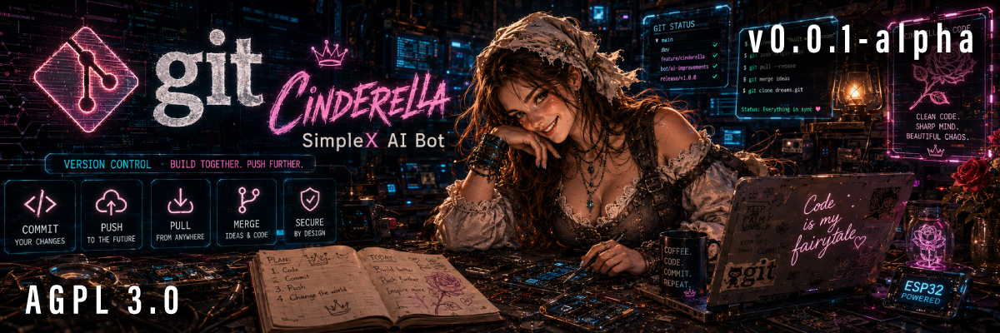

# Cinderella

**The AI bot suite for SimpleX communities.** 
Consent-first archiving that turns a public group's chat into a permanent, searchable, self-owned knowledge base. 
Opt-in only. Public groups only. No cloud, no compromises.

Cinderella is the central intelligence of a growing suite of AI-powered bots for the
[SimpleX](https://simplex.chat/) network. Her first capability is a consent-first
archive for public SimpleX communities: the goal is to turn the fleeting stream of a
public group into a permanent, searchable, web-findable knowledge base — but only for
the groups that want it, and only for the members who opt in.

What ships today is the **foundation**: consent-gated capture and the hardened
operator console. The searchable, web-findable public archive — and a team of further
bots and functions — follow from here. This is the first drop, not the whole ocean.

## What Cinderella is for

SimpleX is private and ephemeral by design: messages are not meant to persist, and
there are no user identifiers. Cinderella is the deliberate, consent-gated exception
for public communities that want the opposite for their shared knowledge —
permanence, discoverability on the open web (SEO), and the ability to keep using what
was said instead of letting it vanish in the scroll.

Cinderella is for **public groups only** — not private ones. She is built for open
communities that choose to make their conversations last and be found.

## Consent is the core

Two gates, always:

- a community enables the feature, and
- each member still opts in themselves.

Send `/publish` to opt your messages into the archive, `/unpublish` to withdraw at
any time. Only what you send **after** opting in is ever eligible — nothing from
before, and nothing at all without opt-in. This is enforced at the core, not bolted
on. *(Consent is recorded and enforced today; the public front-end that renders the
archive to the web is on the [roadmap](#roadmap).)*

## What's in the suite today

- **Consent-first capture** — text, images, video, voice, links and files from a
  public group, captured into a structured, long-lived archive.
- **Per-member consent** — `/publish` / `/unpublish`, forward-only from opt-in,
  revocable, with publication state *derived* from consent rather than a stale stored
  flag.
- **Hardened operator console** — a passwordless, passkey-secured admin console over
  real TLS, with the full defensive stack (see [Security](#security-by-design)).
- **Embed management** — configure the public archive's theme, filters and embed
  snippet from the console. *(The public front-end that renders those embeds to
  visitors is on the [roadmap](#roadmap).)*

## Roadmap

Cinderella grows. Planned next:

- **Public archive front** — an embeddable, browsable, indexable stream of the
  published archive.
- **Command & moderation system** — private per-member onboarding and moderation
  through SimpleX's member-support scope.
- **Per-community categorized highlights** — automatic categorization, tuned per
  community, so a code community's archive is organized like one.
- **Local AI brain** — inference on our own hardware, so no conversation ever leaves
  our control.
- **Multi-tenancy & self-service** — communities managing their own archives and
  subscriptions.

## Security by design

Security is the point, not a feature:

- **Passwordless passkeys (WebAuthn/FIDO2)** — device-bound, phishing- and
  brute-force-resistant.
- **Real TLS** with strict security headers and HSTS.
- **Least-privilege, isolated service** — the bot exposes no public network surface;
  captured media and content are served only behind authentication.
- **PostgreSQL-backed sessions, a full audit log, rate-limiting**, and a configurable
  hardening suite — all steerable from the console.
- **Your data stays yours** — and with the planned local AI brain, conversations
  never leave your infrastructure.

## Tech

TypeScript · Node.js · the in-process
[`simplex-chat`](https://github.com/simplex-chat/simplex-chat) library · PostgreSQL ·
Fastify + htmx + Tailwind · WebAuthn.

## Status

`v0.0.1-alpha` — early, live, and evolving.

## License

Licensed under the GNU Affero General Public License v3.0 (AGPL-3.0). See
[LICENSE](LICENSE). AGPL applies because Cinderella links the AGPL-licensed
[`simplex-chat`](https://github.com/simplex-chat/simplex-chat) library.

Built on <a href="https://simplex.chat/">SimpleX</a>. Not affiliated with SimpleX Chat.

