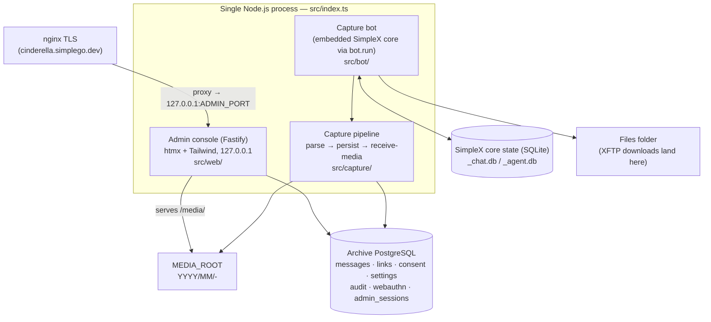
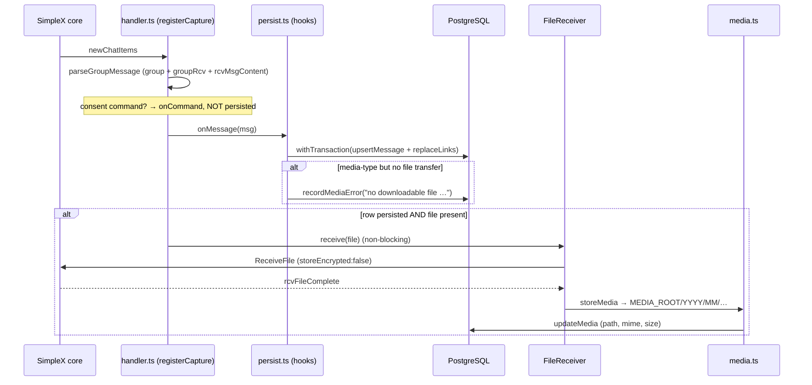

# Cinderella — Architecture

> _Living document — Cinderella, Season 1–2. Ground truth is the code in this repository; where an earlier briefing outline diverged from the code, the divergence is noted inline. Maintained under the CCB briefing scheme; last updated under **CCB-S2-011**._

Cinderella is a consent-first archive bot for a public SimpleX group. She joins the group (`Cyb3rD3sk`), captures opted-in members' messages into PostgreSQL and an on-disk media store, and exposes a hardened admin console. Nothing a member posts is ever published unless that member sent `/publish` — publication is *derived* from the `consent` table and the message-state views, never a stored flag (the views are created in `migrations/002_consent.sql` and refined in `004_moderation.sql` / `005_deletion_provenance.sql`).

This document describes the *runtime* architecture as it exists in code. Where the task outline and the code differ, the code is treated as ground truth and the divergence is called out inline (and collected in the appendix).

## 1. System overview

Cinderella runs as **one Node.js process** (`src/index.ts`) that hosts three cooperating parts:

1. **The capture bot** — the embedded SimpleX chat core, booted in-process via the `simplex-chat` SDK. It receives group events and drives the capture pipeline.
2. **The capture pipeline** — parse → persist → receive-media, backed by PostgreSQL (`src/capture/`, `src/db/`).
3. **The admin console** — a Fastify web app (htmx + Tailwind, no SPA) bound to `127.0.0.1`, fronted by nginx TLS in production (`src/web/`).

`src/index.ts::runApp` wires them together in a single process: it asserts the archive DB is ready (`assertDbReady`), loads live settings (`SettingsService.load`) and security config (`SecurityService.load`), starts the admin server (`startAdminServer`), then starts the capture worker (`startCaptureWorker`). A shared `SIGINT`/`SIGTERM` handler shuts down the admin server, the bot, and the DB pool in that order (`src/index.ts:161-169`).

```
node dist/index.js            → run the capture bot + admin console (long-lived)
node dist/index.js --check    → validate config and exit 0 (Stage 0 check)
```

> Note: `CLAUDE.md` gives the migration runner as `node dist/db/migrate.js`, while `package.json` exposes it as `npm run migrate` (`tsx src/db/migrate.ts`, `package.json:23`) and `src/index.ts:49` tells the operator to run `npm run migrate`. Both invoke the same runner (`src/db/migrate.ts`) — one compiled, one via `tsx`.

### Component diagram



### Data-flow sequence



## 2. In-process SDK topology — no WebSocket daemon

`package.json` declares `"simplex-chat": "^6.5.4"` (`package.json:45`); the SDK docstring in `src/bot/avatar.ts:6` references the 6.5.4 `bot.ts`. The SDK embeds the Haskell core in-process as a native addon. `src/bot/client.ts::startBot` calls `bot.run(...)` (`client.ts:80`), loading the core, opening the local SimpleX DB, and starting the event loop inside Cinderella's own process. There is **no separate SimpleX daemon and no exposed WebSocket port** — the deprecated ≤0.3.x WebSocket-daemon model is not used. Events are wired on the in-process `chat` handle: `newChatItems`, `chatItemUpdated`, `groupChatItemsDeleted`, `chatItemsDeleted` in `handler.ts`; `rcvFileComplete` / `rcvFileError` / `rcvFileWarning` in `client.ts:116-120`.

## 3. Two databases, kept separate

The SimpleX core's state is SQLite at `<simplexDbPrefix>_chat.db` / `<simplexDbPrefix>_agent.db` (`SIMPLEX_DB_PREFIX`, opened via `bot.run({ dbOpts: { type: 'sqlite', filePrefix } })` at `client.ts:88`), holding the bot's identity/contacts/group/transfer state, protected by filesystem permissions only. The archive is PostgreSQL (`DATABASE_URL`, `pg.Pool` in `db/pool.ts`), holding messages, links, consent, settings, audit, webauthn credentials, and admin sessions. Media bytes live in neither DB — only a relative path is stored (§4). `index.ts::assertDbReady` gates startup on the archive DB: `assertDbReachable` runs `SELECT 1`, then it checks `to_regclass('public.messages')` (`index.ts:45-50`).

## 4. Media store layout and the XFTP temp-dir (EXDEV) constraint

`client.ts::ensureDirs` creates the SimpleX DB dir, the files folder, `MEDIA_ROOT`, and `<parent-of-files-folder>/xftp-tmp`, then pins `process.env['TMPDIR']` to that temp dir before startup (`client.ts:37-45`). Reason: the core stages/decrypts XFTP downloads in a temp dir then `rename()`s them into the files folder; if temp is on a different device (the default OS temp is `/tmp`, a tmpfs, further isolated by the systemd unit's `PrivateTmp`) the rename fails with `EXDEV` and every receive stalls. Pinning temp to the files-folder filesystem makes it a cheap same-device rename.

`media.ts::storeMedia` moves completed files into `MEDIA_ROOT/YYYY/MM/<fileId>-<sanitized-name>` (UTC date bucket from `msg.sentAt`, name sanitized to `[A-Za-z0-9._-]` and truncated to 120 chars). The DB stores the relative POSIX path, the MIME type (derived from the file extension, default `application/octet-stream` via `mimeForFileName`), and the on-disk size — never the bytes. The admin console serves the tree at `/media/` (`server.ts:119-124`).

> Note: the outline says the XFTP temp dir must share "the media filesystem." The code pins `TMPDIR` next to the **files folder** — `join(dirname(cfg.simplexFilesFolder), 'xftp-tmp')`, set at `client.ts:44` — not `MEDIA_ROOT`. The constraint solved there is temp-vs-files-folder (the core's internal rename). The separate files-folder → media-store move is a distinct step that tolerates `EXDEV` via copy+unlink (`media.ts::moveFile`, `media.ts:69-81`).

## 5. Avatar propagation (SDK-native)

The avatar is carried inside the profile passed to `bot.run` (`client.ts:77-107`, `avatar.ts`). `loadAvatarDataUri` downscales via `sharp` to a small square JPEG data URI kept under a 12,000-char budget (`MAX_DATA_URI_CHARS`), comfortably below the ~15,610-byte profile envelope. `updateProfile` is set to `image !== undefined` (`client.ts:103`) so the SDK applies/self-heals the full profile (image included) only when an image is loaded — and does **not** blank the avatar when the file is absent. `apiUpdateProfile` reaches direct CONTACTS only (the bot has none); existing GROUP members get the avatar (`XInfo`) only when the bot next sends a group message. `avatar.ts::flushAvatarToGroups` — called once from `index.ts::startCaptureWorker` (`index.ts:113`) — sends one minimal group message (`🕯️✨`, `FLUSH_MESSAGE`) per distinct avatar, gated by a SHA-256 marker in `settings` (`avatarGroupFlushMarker`, `FLUSH_MARKER_KEY`).

> Note: the outline and the `AVATAR_PATH` docstring (`config.ts:35-39`) describe the older behaviour — "Re-applied to the SimpleX profile on every startup (bot.run blanks it otherwise)." The current code does the opposite by design and specifically guards against blanking (see the comment at `client.ts:95-102`); the `config.ts` comment is stale relative to the implementation.

## 6. Data flow: message in → parse → persist → media receive

Parse (`message.ts::parseGroupMessage`, keeps only group + `groupRcv` + `rcvMsgContent`, extracts the stable `senderMemberId` and the chat-item `itemId`, which is persisted as `group_msg_id`) → scope + classify (`handler.ts`, prefers the stable `targetGroupId` resolved once at startup so a group rename doesn't stop capture; consent commands are routed to `onCommand` and **not** persisted) → persist (`persist.ts`'s `onMessage` hook, `withTransaction(upsertMessage + replaceLinks)`; a media-type message with no file transfer is recorded via `recordMediaError`) → receive media, non-blocking, only if the row persisted and a file is present (`FileReceiver.receive` registers the pending entry *before* issuing `ReceiveFile` with `storeEncrypted:false`, resolves on `rcvFileComplete`; a timeout, `rcvFileError`, or a rejecting command response reject; `rcvFileWarning` is transient) → store + record (`storeMedia` + `updateMedia`; an orphan is flagged if no row exists; `onFileFailed` records a `media_error`). Edits re-persist (overwriting pre-edit text, `chatItemUpdated`); in-group deletions route to the idempotent `markDeleted`, keyed by `(group_id, group_msg_id)`.

## 7. The admin console

`web/server.ts` builds Fastify with `trustProxy: 'loopback'` (`server.ts:82`), listening on `127.0.0.1:ADMIN_PORT` (default 8787), never a public interface; nginx TLS fronts it at `cinderella.simplego.dev`. Server-rendered HTML with htmx (`public/assets/htmx.min.js`, vendored by `scripts/copy-assets.mjs`, detected via the `hx-request` header) plus Tailwind (`assets/app.css` → `public/assets/app.css`); no SPA. Controls enforced in-process: configurable security headers (`applySecurityHeaders`), a global rate limit and IP allow/deny policy (`GlobalRateLimiter`, `ipAllowed`), session read + auth guard, CSRF on all mutations (`csrfOk`), and step-up re-verification for sensitive mutations. Primary auth is passkeys/WebAuthn (`@simplewebauthn`) with an Argon2id break-glass path (+ optional TOTP). Sessions are persisted in PostgreSQL (`admin_sessions`, `007_sessions.sql`).

## 8. Configuration and secrets

Configuration is env-driven (`config.ts`), from a git-ignored `.env` in development or systemd in production; `redactConfig` scrubs the DB password (and credential-bearing query params) before logging. `loadConfig` reads `BOT_DISPLAY_NAME`, `SIMPLEX_DB_PREFIX`, `SIMPLEX_FILES_FOLDER`, `GROUP_NAME`, `MEDIA_ROOT`, `AVATAR_PATH`, `DATABASE_URL` (the only required var), and `LOG_LEVEL`. `loadAdminConfig` (loaded lazily, only when the admin server starts) reads `ADMIN_PORT`, `ADMIN_USERNAME`, `ADMIN_PASSWORD_HASH` (must be Argon2id), `SESSION_SECRET` (≥ 32 chars), `PUBLIC_ORIGIN`, and the optional `WEBAUTHN_RP_ID` / `WEBAUTHN_ORIGIN` / `WEBAUTHN_RP_NAME` (defaulted from `PUBLIC_ORIGIN`). It then calls `validateRpConfig` (CCB-S2-011): the effective RP ID must be the WebAuthn origin's host (or a registrable parent) or the server refuses to boot — an RP-ID/origin drift otherwise silently invalidates every registered passkey. The effective RP ID/origin are logged at admin startup (§7 / D-022).

## 9. Schema / migrations

- **001** `init` — enums (`message_type`, `moderation_state`), `messages`, `links`, FTS.
- **002** `consent` — `consent` table + the `message_publish_state` / `published_messages` publish views.
- **003** `admin` — `settings`, `audit_log`.
- **004** `moderation` — adds `messages.media_error` and folds `moderation_state='rejected'` into the publish views (views dropped + recreated).
- **005** `deletion_provenance` — splits `group_deleted` (in-group, non-clearable) from the admin-initiated `deleted`.
- **006** `webauthn` — `webauthn_credentials` + break-glass TOTP.
- **007** `sessions` — `admin_sessions` (persisted across restarts).

Each migration is applied once, inside a transaction, by `db/migrate.ts`.

> Note: `CLAUDE.md`'s migrations list labels 004 the "moderation gate"; the file itself is headed "Cinderella admin views support — Season 0, Stage 5" (`migrations/004_moderation.sql:1`) and its concrete effect is adding `media_error` and folding `rejected` into the publish views. It implements the takedown gate in the views but is not exclusively about moderation.

## 10. Planned / not yet implemented

Per `CLAUDE.md`'s "Parked" section:

- **`/embed/<id>` public front now SHIPPED** (§11) — the SSR front, server-side
  filters/search, and consent-gated media (CCB-S2-003); the full SEO/marketing suite
  (CCB-S2-004); house-palette theming with a light/dark toggle (CCB-S2-005); and
  consent-gated live auto-update (CCB-S2-006). Still planned: multiple templates, a
  design editor, the Web Component, an SSE upgrade of the live-update transport, and
  SSR caching with publish-event invalidation.
- **AI moderation / CSAM scanning** — `moderation_state` is only a hook (every row stays `'none'`); the scanning track is separate and unbuilt.
- **Self-hosted relay/super-peer capture.**

## 11. Public archive front (CCB-S2-003)

The public, unauthenticated `/embed/<id>` front is deliberately layered so later
briefings extend it without touching consent logic:

- **Data layer** — [`src/db/public-archive.ts`](../src/db/public-archive.ts):
  `listPublishedItems`, `listPublishedIds` (the cheap ids + version-hash query for
  the live poll, CCB-S2-006), and `getPublishedMedia` read **only** through the
  `published_messages` view (the consent gate) — a shared `buildPublishedWhere`
  keeps the item and ids queries filtering identically. Filters (media type, UTC time
  window, `websearch_to_tsquery('simple', …)` over the generated `search` vector)
  run in SQL, so filtered/searched views are server-rendered and crawlable.
- **Presentation layer** — [`src/web/front/render.ts`](../src/web/front/render.ts):
  one entry point `renderEmbedPage(ctx)` takes a `PresentationConfig` (template +
  theme + layout, from the `embed_instances` record) and returns full SSR HTML —
  content rendered into the markup (the SEO foundation), not client-JS-rendered. The
  head carries `<title>`/description, canonical, Open Graph + Twitter, and an
  extensible schema.org JSON-LD `@graph` (WebSite · Organization · ItemList of
  DiscussionForumPosting). The list-and-pager region factors into
  `renderStreamRegion` / `renderStreamFragment` (CCB-S2-006) so the live fragment and
  the full page render identical markup. The seam is where later templates and a
  design editor plug in.
- **Routes** — [`src/web/front/embed.ts`](../src/web/front/embed.ts): `GET /embed/:id`
  (page) and `GET /embed/:id/media/:msgId` (media, resolved through the published
  check every request). Registered in `buildServer` outside the admin auth guard;
  `/embed/*` is exempt from auth, the admin IP policy, and the admin rate-limit, and
  sets its own headers (embeddable `frame-ancestors *`, indexable, `no-store`, a
  per-response CSP nonce) — the admin strict headers are skipped for `/embed/*` in
  the onSend hook. The iframe posts its height to the parent
  (`{cinderellaEmbedHeight}`), matching the Season 1 snippet. Verified end-to-end by
  [`scripts/verify-public.ts`](../scripts/verify-public.ts).
- **SEO & marketing suite (CCB-S2-004)** — [`src/web/front/seo.ts`](../src/web/front/seo.ts)
  holds all artifact builders (resolved head, the toggle-driven schema.org JSON-LD
  `@graph`, sitemap, RSS feed, robots.txt, and an auto OG image via `sharp`). They
  all consume the SAME consent-gated data and hang off the instance's `seo` config
  ([`src/db/embeds.ts`](../src/db/embeds.ts) `SeoSettings`, admin-edited in
  [`src/web/views/embeds.ts`](../src/web/views/embeds.ts)), so the render path stays
  single. New public routes: `/embed/:id/sitemap.xml`, `/embed/:id/feed.xml`,
  `/embed/:id/og.png`, and the origin-level `/robots.txt` + `/sitemap.xml` (index).
  `isPublicFront()` now also covers `/robots.txt` and `/sitemap.xml`. Verified by the
  extended `verify:public` (structured-data toggles, sitemap/feed/robots, OG image,
  analytics-CSP, and the consent gate across every new output).
- **Theming (CCB-S2-005)** — the front ships the SimpleGo house palette, **dark by
  default** via `data-theme="dark"` on `<html>` (`:root` is light). The instance
  `mode` (auto/light/dark) sets the SSR initial theme; a no-flash inline `<head>`
  script reads `localStorage['sg-theme']` (the same key as the operator's site)
  before paint, and a sun/moon toggle in the header flips + persists it and updates
  the `theme-color` meta. Operator accent/bg/text overrides still win over the house
  tokens when set (compared against the built-in defaults in `themeCss`). All
  nonce-guarded — no CSP change — and the SSR content/SEO are untouched (progressive
  enhancement). In [`src/web/front/render.ts`](../src/web/front/render.ts).
- **Live auto-update + infinite scroll (CCB-S2-006/007)** — an open page keeps itself
  current AND pages the full archive with no manual refresh, as progressive enhancement
  over the unchanged SSR/SEO baseline. The stream pages by a stable `(sent_at, id)`
  cursor (`listPublishedItemsByCursor`), not offset, so nothing dupes/skips under
  concurrent publish/recall. Consent-gated routes
  ([`src/web/front/embed.ts`](../src/web/front/embed.ts)), all reading
  `published_messages`: `GET /embed/:id/page?cursor=&dir=older|newer` → JSON
  `{ html, nextCursor, hasMore }` of bare `<li>` cards (`renderCards`, byte-identical to
  SSR); `GET /embed/:id/state?cursor=<bottom>&top=<top>` fingerprints the EXACT loaded
  band (`listPublishedSpanState`; ids + hash + `hasNewer`). The single inline
  `STREAM_SCRIPT` owns one loaded-item model: a bottom `IntersectionObserver` appends
  older cards and windows the top behind a height spacer (DOM bounded at `WINDOW_CAP`); a
  top sentinel restores windowed-off cards on scroll-up by re-fetching (never stashing —
  so a recalled card can't return); the ~18s poll sweeps out any recalled id wherever it
  sits and prepends new publishes at the true head. Windowing is symmetric (trim top on
  down-scroll, trim bottom on restore) so the loaded set never exceeds the span LIMIT.
  A recalled item vanishes (media `404`s) within one interval; a new one appears live.
  CSP change is `connect-src 'self'` only; `/page` and `/state` have SEPARATE per-IP
  rate-limit buckets (a scroll burst can't starve the consent poll). Deep content stays
  crawlable via the untouched `?page=N` SSR pages + `<link rel=prev/next>` + sitemap;
  JS-off keeps the pager. The `/fragment` route + wholesale swap (CCB-S2-006) are
  retired. SSE + full virtualization are recorded future upgrades. Verified by the
  extended [`scripts/verify-public.ts`](../scripts/verify-public.ts) + a windowing
  simulation.
- **Loading polish (CCB-S2-010)** — three infinite-scroll UX fixes, all in the
  client/CSS ([`src/web/front/render.ts`](../src/web/front/render.ts)): (1) the no-flash
  `<head>` script marks `html.embedded` when framed, and `html.embedded{overflow:hidden}`
  hides the iframe body's own scrollbar (the host scrolls the auto-sized frame) — killing
  the transient scrollbar flash between an append and the height re-post, before the first
  paint; (2) a house-themed **skeleton loader** (shimmer placeholder cards, indeterminate —
  the chunk fetch is small so byte-progress adds no value; `prefers-reduced-motion` honoured)
  reserves space at the bottom while a chunk fetches, replaced by the real cards on arrival,
  with an error/retry state; (3) appended/prepended cards **fade + rise in** (`card-in`), and
  because bottom-appends grow below the fold the viewport never shifts. Direct (top-level)
  views keep the normal document scrollbar.
- **Media playback (CCB-S2-008)** — video renders as an INLINE native `<video controls
  preload="metadata" playsinline>` in the card (`itemMedia`,
  [`src/web/front/render.ts`](../src/web/front/render.ts)), house-styled and theme-aware,
  replacing the old "Open video" link. A themed Download button is gated by the new
  per-instance `player.showDownload` (default ON; OFF → button hidden +
  `controlsList="nodownload"`). The embed CSP adds `media-src 'self'`, and the
  consent-gated media route now serves HTTP **byte-ranges** (`206` / `Accept-Ranges` /
  `Content-Range`, strictly after the consent gate) so WebKit plays inline and seeking
  works; the copy-paste snippet's iframe gains `allow="fullscreen"` so the native
  fullscreen button works cross-origin. `HEIGHT_SCRIPT` re-posts iframe height on
  `loadedmetadata` + `fullscreenchange`.
- **Content reporting (CCB-S2-009)** — a per-item no-JS `<details>` "Report" form
  ([`renderCards`](../src/web/front/render.ts)) posts to `POST /embed/:id/report` — the
  ONE mutating public-front route (exempt from the admin CSRF/auth preHandler; rate-limited
  own bucket; cross-site rejected via `Sec-Fetch-Site`). It gates on `isPublished`
  (`published_messages`, D-016) with a neutral 303 (no oracle) and NEVER changes
  publication (visible-until-review); it stores minimal data (`migrations/008_reports.sql`
  + [`src/db/reports.ts`](../src/db/reports.ts)) — a keyed daily-rotating `HMAC` token, no
  raw IP. The admin side ([`src/web/views/reports.ts`](../src/web/views/reports.ts)) is a
  grouped `/reports` queue with consent/auth-gated previews and audited take-down / resolve
  / dismiss (takedown reuses `setModerationState`); an open-count bar is injected into every
  admin page via an `onSend` comment marker. External alerts are an inert Settings
  placeholder. Verified by
  [`scripts/verify-public.ts`](../scripts/verify-public.ts) +
  [`scripts/verify-admin-views.ts`](../scripts/verify-admin-views.ts).

## Appendix: divergences (code wins)

Each divergence below is also noted inline at the relevant section. In every case the **code is treated as ground truth** and the conflicting outline/comment is flagged as stale.

1. **XFTP temp dir location.** Outline: the temp dir must share the *media* filesystem (`MEDIA_ROOT`). Code: `ensureDirs` pins `process.env['TMPDIR']` to `dirname(cfg.simplexFilesFolder)/xftp-tmp` — next to the **files folder**, not `MEDIA_ROOT` (`client.ts:41-44`). The `EXDEV` risk solved there is the core's internal temp→files-folder rename; the separate files-folder→media-store move tolerates `EXDEV` via copy+unlink (`media.ts:69-81`).

2. **Avatar re-application.** Outline and `config.ts:35-39` docstring: the avatar is re-applied every startup because `bot.run` blanks it otherwise. Code: the image is carried in the boot profile and `updateProfile` is set to `image !== undefined` (`client.ts:103`) *specifically so the SDK does not reconcile/blank the avatar when the file is absent*; it self-heals only when an image is loaded and differs. The `config.ts` comment is stale.

3. **Migration 004 label.** `CLAUDE.md` calls 004 the "moderation gate." The file (`migrations/004_moderation.sql:1`) is headed "admin views support — Stage 5"; its concrete changes are `messages.media_error` and folding `moderation_state='rejected'` into the publish views.

4. **Migration runner invocation.** `CLAUDE.md` gives `node dist/db/migrate.js`; `package.json:23` and `src/index.ts:49` point operators at `npm run migrate` (`tsx src/db/migrate.ts`). Same runner, different invocation (compiled vs `tsx`).
