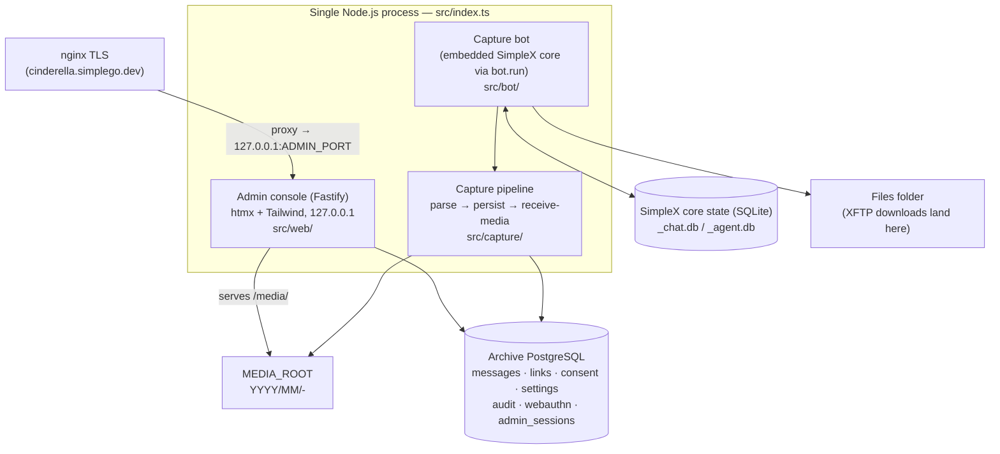
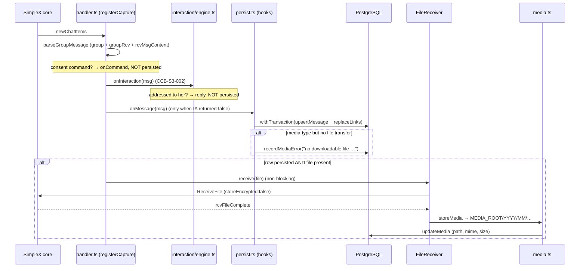

# Cinderella — Architecture

> _Living document — Cinderella, Seasons 1–3. Ground truth is the code in this repository; where an earlier briefing outline diverged from the code, the divergence is noted inline. Maintained under the CCB briefing scheme; last updated under **CCB-S3-010**._

Cinderella is a consent-first archive bot for a public SimpleX group. She joins the group (`Cyb3rD3sk`), captures opted-in members' messages into PostgreSQL and an on-disk media store, and exposes a hardened admin console. Nothing a member posts is ever published unless that member sent `/publish` — publication is _derived_ from the `consent` table and the message-state views, never a stored flag (the views are created in `migrations/002_consent.sql` and refined in `004_moderation.sql` / `005_deletion_provenance.sql`).

This document describes the _runtime_ architecture as it exists in code. Where the task outline and the code differ, the code is treated as ground truth and the divergence is called out inline (and collected in the appendix).

## 1. System overview

Cinderella runs as **one Node.js process** (`src/index.ts`) that hosts three cooperating parts:

1. **The capture bot** — the embedded SimpleX chat core, booted in-process via the `simplex-chat` SDK. It receives group events and drives the capture pipeline.
2. **The capture pipeline** — parse → persist → receive-media, backed by PostgreSQL (`src/capture/`, `src/db/`).
3. **The admin console** — a Fastify web app (htmx + Tailwind, no SPA) bound to `127.0.0.1`, fronted by nginx TLS in production (`src/web/`).

`src/index.ts::runApp` wires them together in a single process: it asserts the archive DB is ready (`assertDbReady`), loads live settings (`SettingsService.load`) and security config (`SecurityService.load`), starts the admin server (`startAdminServer`), then starts the capture worker (`startCaptureWorker`). A shared `SIGINT`/`SIGTERM` handler shuts down the admin server, the bot, and the DB pool in that order (`src/index.ts:161-169`).

```
node dist/index.js            → run the capture bot + admin console (long-lived)
node dist/index.js --check    → validate config and exit 0 (Stage 0 check)
```

> Note: `CLAUDE.md` gives the migration runner as `node dist/db/migrate.js`, while `package.json` exposes it as `npm run migrate` (`tsx src/db/migrate.ts`, `package.json:23`) and `src/index.ts:49` tells the operator to run `npm run migrate`. Both invoke the same runner (`src/db/migrate.ts`) — one compiled, one via `tsx`.

### Component diagram



### Data-flow sequence



## 2. In-process SDK topology — no WebSocket daemon

`package.json` declares `"simplex-chat": "^6.5.4"` (`package.json:45`); the SDK docstring in `src/bot/avatar.ts:6` references the 6.5.4 `bot.ts`. The SDK embeds the Haskell core in-process as a native addon. `src/bot/client.ts::startBot` calls `bot.run(...)` (`client.ts:80`), loading the core, opening the local SimpleX DB, and starting the event loop inside Cinderella's own process. There is **no separate SimpleX daemon and no exposed WebSocket port** — the deprecated ≤0.3.x WebSocket-daemon model is not used. Events are wired on the in-process `chat` handle: `newChatItems`, `chatItemUpdated`, `groupChatItemsDeleted`, `chatItemsDeleted` in `handler.ts`; `rcvFileComplete` / `rcvFileError` / `rcvFileWarning` in `client.ts:116-120`.

## 3. Two databases, kept separate

The SimpleX core's state is SQLite at `<simplexDbPrefix>_chat.db` / `<simplexDbPrefix>_agent.db` (`SIMPLEX_DB_PREFIX`, opened via `bot.run({ dbOpts: { type: 'sqlite', filePrefix } })` at `client.ts:88`), holding the bot's identity/contacts/group/transfer state, protected by filesystem permissions only. The archive is PostgreSQL (`DATABASE_URL`, `pg.Pool` in `db/pool.ts`), holding messages, links, consent, settings, audit, webauthn credentials, and admin sessions. Media bytes live in neither DB — only a relative path is stored (§4). `index.ts::assertDbReady` gates startup on the archive DB: `assertDbReachable` runs `SELECT 1`, then it checks `to_regclass('public.messages')` (`index.ts:45-50`).

## 4. Media store layout and the XFTP temp-dir (EXDEV) constraint

`client.ts::ensureDirs` creates the SimpleX DB dir, the files folder, `MEDIA_ROOT`, and `<parent-of-files-folder>/xftp-tmp`, then pins `process.env['TMPDIR']` to that temp dir before startup (`client.ts:37-45`). Reason: the core stages/decrypts XFTP downloads in a temp dir then `rename()`s them into the files folder; if temp is on a different device (the default OS temp is `/tmp`, a tmpfs, further isolated by the systemd unit's `PrivateTmp`) the rename fails with `EXDEV` and every receive stalls. Pinning temp to the files-folder filesystem makes it a cheap same-device rename.

`media.ts::storeMedia` moves completed files into `MEDIA_ROOT/YYYY/MM/<fileId>-<sanitized-name>` (UTC date bucket from `msg.sentAt`, name sanitized to `[A-Za-z0-9._-]` and truncated to 120 chars). The DB stores the relative POSIX path, the MIME type (derived from the file extension, default `application/octet-stream` via `mimeForFileName`), and the on-disk size — never the bytes. The admin console serves the tree at `/media/` (`server.ts:119-124`).

> Note: the outline says the XFTP temp dir must share "the media filesystem." The code pins `TMPDIR` next to the **files folder** — `join(dirname(cfg.simplexFilesFolder), 'xftp-tmp')`, set at `client.ts:44` — not `MEDIA_ROOT`. The constraint solved there is temp-vs-files-folder (the core's internal rename). The separate files-folder → media-store move is a distinct step that tolerates `EXDEV` via copy+unlink (`media.ts::moveFile`, `media.ts:69-81`).

## 5. Avatar propagation (SDK-native)

The avatar is carried inside the profile passed to `bot.run` (`client.ts:77-107`, `avatar.ts`). `loadAvatarDataUri` downscales via `sharp` to a small square JPEG data URI kept under a 12,000-char budget (`MAX_DATA_URI_CHARS`), comfortably below the ~15,610-byte profile envelope. `updateProfile` is set to `image !== undefined` (`client.ts:103`) so the SDK applies/self-heals the full profile (image included) only when an image is loaded — and does **not** blank the avatar when the file is absent. `apiUpdateProfile` reaches direct CONTACTS only (the bot has none); existing GROUP members get the avatar (`XInfo`) only when the bot next sends a group message. `avatar.ts::flushAvatarToGroups` — called once from `index.ts::startCaptureWorker` (`index.ts:113`) — sends one minimal group message (`🕯️✨`, `FLUSH_MESSAGE`) per distinct avatar, gated by a SHA-256 marker in `settings` (`avatarGroupFlushMarker`, `FLUSH_MARKER_KEY`).

> Note: the outline and the `AVATAR_PATH` docstring (`config.ts:35-39`) describe the older behaviour — "Re-applied to the SimpleX profile on every startup (bot.run blanks it otherwise)." The current code does the opposite by design and specifically guards against blanking (see the comment at `client.ts:95-102`); the `config.ts` comment is stale relative to the implementation.

## 6. Data flow: message in → parse → persist → media receive

Parse (`message.ts::parseGroupMessage`, keeps only group + `groupRcv` + `rcvMsgContent`, extracts the stable `senderMemberId` and the chat-item `itemId`, which is persisted as `group_msg_id`) → scope + classify (`handler.ts`, prefers the stable `targetGroupId` resolved once at startup so a group rename doesn't stop capture; consent commands are routed to `onCommand` and **not** persisted) → persist (`persist.ts`'s `onMessage` hook, `withTransaction(upsertMessage + replaceLinks)`; a media-type message with no file transfer is recorded via `recordMediaError`) → receive media, non-blocking, only if the row persisted and a file is present (`FileReceiver.receive` registers the pending entry _before_ issuing `ReceiveFile` with `storeEncrypted:false`, resolves on `rcvFileComplete`; a timeout, `rcvFileError`, or a rejecting command response reject; `rcvFileWarning` is transient) → store + record (`storeMedia` + `updateMedia`; an orphan is flagged if no row exists; `onFileFailed` records a `media_error`). Edits re-persist (overwriting pre-edit text, `chatItemUpdated`); in-group deletions route to the idempotent `markDeleted`, keyed by `(group_id, group_msg_id)`.

## 7. The admin console

`web/server.ts` builds Fastify with `trustProxy: 'loopback'` (`server.ts:82`), listening on `127.0.0.1:ADMIN_PORT` (default 8787), never a public interface; nginx TLS fronts it at `cinderella.simplego.dev`. Server-rendered HTML with htmx (`public/assets/htmx.min.js`, vendored by `scripts/copy-assets.mjs`, detected via the `hx-request` header) plus Tailwind (`assets/app.css` → `public/assets/app.css`); no SPA. Controls enforced in-process: configurable security headers (`applySecurityHeaders`), a global rate limit and IP allow/deny policy (`GlobalRateLimiter`, `ipAllowed`), session read + auth guard, CSRF on all mutations (`csrfOk`), and step-up re-verification for sensitive mutations. Primary auth is passkeys/WebAuthn (`@simplewebauthn`) with an Argon2id break-glass path (+ optional TOTP). Sessions are persisted in PostgreSQL (`admin_sessions`, `007_sessions.sql`).

## 8. Configuration and secrets

Configuration is env-driven (`config.ts`), from a git-ignored `.env` in development or systemd in production; `redactConfig` scrubs the DB password (and credential-bearing query params) before logging. `loadConfig` reads `BOT_DISPLAY_NAME`, `SIMPLEX_DB_PREFIX`, `SIMPLEX_FILES_FOLDER`, `GROUP_NAME`, `MEDIA_ROOT`, `AVATAR_PATH`, `DATABASE_URL` (the only required var), and `LOG_LEVEL`. `loadAdminConfig` (loaded lazily, only when the admin server starts) reads `ADMIN_PORT`, `ADMIN_USERNAME`, `ADMIN_PASSWORD_HASH` (must be Argon2id), `SESSION_SECRET` (≥ 32 chars), `PUBLIC_ORIGIN`, and the optional `WEBAUTHN_RP_ID` / `WEBAUTHN_ORIGIN` / `WEBAUTHN_RP_NAME` (defaulted from `PUBLIC_ORIGIN`). It then calls `validateRpConfig` (CCB-S2-011): the effective RP ID must be the WebAuthn origin's host (or a registrable parent) or the server refuses to boot — an RP-ID/origin drift otherwise silently invalidates every registered passkey. The effective RP ID/origin are logged at admin startup (§7 / D-022).

## 9. Schema / migrations

- **001** `init` — enums (`message_type`, `moderation_state`), `messages`, `links`, FTS.
- **002** `consent` — `consent` table + the `message_publish_state` / `published_messages` publish views.
- **003** `admin` — `settings`, `audit_log`.
- **004** `moderation` — adds `messages.media_error` and folds `moderation_state='rejected'` into the publish views (views dropped + recreated).
- **005** `deletion_provenance` — splits `group_deleted` (in-group, non-clearable) from the admin-initiated `deleted`.
- **006** `webauthn` — `webauthn_credentials` + break-glass TOTP.
- **007** `sessions` — `admin_sessions` (persisted across restarts).
- **008** `reports` — public content reports + the admin review queue.
- **009** `consent_actions` — the consent decision journal (source + prior state) that makes UNDO possible (CCB-S3-002). Provenance only; the publish views still derive from `consent` alone.

Each migration is applied once, inside a transaction, by `db/migrate.ts`.

> Note: `CLAUDE.md`'s migrations list labels 004 the "moderation gate"; the file itself is headed "Cinderella admin views support — Season 0, Stage 5" (`migrations/004_moderation.sql:1`) and its concrete effect is adding `media_error` and folding `rejected` into the publish views. It implements the takedown gate in the views but is not exclusively about moderation.

## 10. Planned / not yet implemented

Per `CLAUDE.md`'s "Parked" section:

- **`/embed/<id>` public front now SHIPPED** (§11) — the SSR front, server-side
  filters/search, and consent-gated media (CCB-S2-003); the full SEO/marketing suite
  (CCB-S2-004); house-palette theming with a light/dark toggle (CCB-S2-005); and
  consent-gated live auto-update (CCB-S2-006). Still planned: multiple templates, a
  design editor, the Web Component, an SSE upgrade of the live-update transport, and
  SSR caching with publish-event invalidation.
- **AI moderation / CSAM scanning** — `moderation_state` is only a hook (every row stays `'none'`); the scanning track is separate and unbuilt.
- **Self-hosted relay/super-peer capture.**

## 11. Public archive front (CCB-S2-003)

The public, unauthenticated `/embed/<id>` front is deliberately layered so later
briefings extend it without touching consent logic:

- **Data layer** — [`src/db/public-archive.ts`](../src/db/public-archive.ts):
  `listPublishedItems`, `listPublishedIds` (the cheap ids + version-hash query for
  the live poll, CCB-S2-006), and `getPublishedMedia` read **only** through the
  `published_messages` view (the consent gate) — a shared `buildPublishedWhere`
  keeps the item and ids queries filtering identically. Filters (media type, UTC time
  window, `websearch_to_tsquery('simple', …)` over the generated `search` vector)
  run in SQL, so filtered/searched views are server-rendered and crawlable.
- **Presentation layer** — [`src/web/front/render.ts`](../src/web/front/render.ts):
  one entry point `renderEmbedPage(ctx)` takes a `PresentationConfig` (template +
  theme + layout, from the `embed_instances` record) and returns full SSR HTML —
  content rendered into the markup (the SEO foundation), not client-JS-rendered. The
  head carries `<title>`/description, canonical, Open Graph + Twitter, and an
  extensible schema.org JSON-LD `@graph` (WebSite · Organization · ItemList of
  DiscussionForumPosting). The list-and-pager region factors into
  `renderStreamRegion` / `renderStreamFragment` (CCB-S2-006) so the live fragment and
  the full page render identical markup. The seam is where later templates and a
  design editor plug in.
- **Routes** — [`src/web/front/embed.ts`](../src/web/front/embed.ts): `GET /embed/:id`
  (page) and `GET /embed/:id/media/:msgId` (media, resolved through the published
  check every request). Registered in `buildServer` outside the admin auth guard;
  `/embed/*` is exempt from auth, the admin IP policy, and the admin rate-limit, and
  sets its own headers (embeddable `frame-ancestors *`, indexable, `no-store`, a
  per-response CSP nonce) — the admin strict headers are skipped for `/embed/*` in
  the onSend hook. The iframe posts its height to the parent
  (`{cinderellaEmbedHeight}`), matching the Season 1 snippet. Verified end-to-end by
  [`scripts/verify-public.ts`](../scripts/verify-public.ts).
- **SEO & marketing suite (CCB-S2-004)** — [`src/web/front/seo.ts`](../src/web/front/seo.ts)
  holds all artifact builders (resolved head, the toggle-driven schema.org JSON-LD
  `@graph`, sitemap, RSS feed, robots.txt, and an auto OG image via `sharp`). They
  all consume the SAME consent-gated data and hang off the instance's `seo` config
  ([`src/db/embeds.ts`](../src/db/embeds.ts) `SeoSettings`, admin-edited in
  [`src/web/views/embeds.ts`](../src/web/views/embeds.ts)), so the render path stays
  single. New public routes: `/embed/:id/sitemap.xml`, `/embed/:id/feed.xml`,
  `/embed/:id/og.png`, and the origin-level `/robots.txt` + `/sitemap.xml` (index).
  `isPublicFront()` now also covers `/robots.txt` and `/sitemap.xml`. Verified by the
  extended `verify:public` (structured-data toggles, sitemap/feed/robots, OG image,
  analytics-CSP, and the consent gate across every new output).
- **Theming (CCB-S2-005)** — the front ships the SimpleGo house palette, **dark by
  default** via `data-theme="dark"` on `<html>` (`:root` is light). The instance
  `mode` (auto/light/dark) sets the SSR initial theme; a no-flash inline `<head>`
  script reads `localStorage['sg-theme']` (the same key as the operator's site)
  before paint, and a sun/moon toggle in the header flips + persists it and updates
  the `theme-color` meta. Operator accent/bg/text overrides still win over the house
  tokens when set (compared against the built-in defaults in `themeCss`). All
  nonce-guarded — no CSP change — and the SSR content/SEO are untouched (progressive
  enhancement). In [`src/web/front/render.ts`](../src/web/front/render.ts).
- **Live auto-update + infinite scroll (CCB-S2-006/007)** — an open page keeps itself
  current AND pages the full archive with no manual refresh, as progressive enhancement
  over the unchanged SSR/SEO baseline. The stream pages by a stable `(sent_at, id)`
  cursor (`listPublishedItemsByCursor`), not offset, so nothing dupes/skips under
  concurrent publish/recall. Consent-gated routes
  ([`src/web/front/embed.ts`](../src/web/front/embed.ts)), all reading
  `published_messages`: `GET /embed/:id/page?cursor=&dir=older|newer` → JSON
  `{ html, nextCursor, hasMore }` of bare `<li>` cards (`renderCards`, byte-identical to
  SSR); `GET /embed/:id/state?cursor=<bottom>&top=<top>` fingerprints the EXACT loaded
  band (`listPublishedSpanState`; ids + hash + `hasNewer`). The single inline
  `STREAM_SCRIPT` owns one loaded-item model: a bottom `IntersectionObserver` appends
  older cards and windows the top behind a height spacer (DOM bounded at `WINDOW_CAP`); a
  top sentinel restores windowed-off cards on scroll-up by re-fetching (never stashing —
  so a recalled card can't return); the ~18s poll sweeps out any recalled id wherever it
  sits and prepends new publishes at the true head. Windowing is symmetric (trim top on
  down-scroll, trim bottom on restore) so the loaded set never exceeds the span LIMIT.
  A recalled item vanishes (media `404`s) within one interval; a new one appears live.
  CSP change is `connect-src 'self'` only; `/page` and `/state` have SEPARATE per-IP
  rate-limit buckets (a scroll burst can't starve the consent poll). Deep content stays
  crawlable via the untouched `?page=N` SSR pages + `<link rel=prev/next>` + sitemap;
  JS-off keeps the pager. The `/fragment` route + wholesale swap (CCB-S2-006) are
  retired. SSE + full virtualization are recorded future upgrades. Verified by the
  extended [`scripts/verify-public.ts`](../scripts/verify-public.ts) + a windowing
  simulation.
- **Loading polish (CCB-S2-010)** — three infinite-scroll UX fixes, all in the
  client/CSS ([`src/web/front/render.ts`](../src/web/front/render.ts)): (1) the no-flash
  `<head>` script marks `html.embedded` when framed, and `html.embedded{overflow:hidden}`
  hides the iframe body's own scrollbar (the host scrolls the auto-sized frame) — killing
  the transient scrollbar flash between an append and the height re-post, before the first
  paint; (2) a house-themed **skeleton loader** (shimmer placeholder cards, indeterminate —
  the chunk fetch is small so byte-progress adds no value; `prefers-reduced-motion` honoured)
  reserves space at the bottom while a chunk fetches, replaced by the real cards on arrival,
  with an error/retry state; (3) appended/prepended cards **fade + rise in** (`card-in`), and
  because bottom-appends grow below the fold the viewport never shifts. Direct (top-level)
  views keep the normal document scrollbar.
- **Media playback (CCB-S2-008)** — video renders as an INLINE native `<video controls
preload="metadata" playsinline>` in the card (`itemMedia`,
  [`src/web/front/render.ts`](../src/web/front/render.ts)), house-styled and theme-aware,
  replacing the old "Open video" link. A themed Download button is gated by the new
  per-instance `player.showDownload` (default ON; OFF → button hidden +
  `controlsList="nodownload"`). The embed CSP adds `media-src 'self'`, and the
  consent-gated media route now serves HTTP **byte-ranges** (`206` / `Accept-Ranges` /
  `Content-Range`, strictly after the consent gate) so WebKit plays inline and seeking
  works; the copy-paste snippet's iframe gains `allow="fullscreen"` so the native
  fullscreen button works cross-origin. `HEIGHT_SCRIPT` re-posts iframe height on
  `loadedmetadata` + `fullscreenchange`.
- **Content reporting (CCB-S2-009)** — a per-item no-JS `<details>` "Report" form
  ([`renderCards`](../src/web/front/render.ts)) posts to `POST /embed/:id/report` — the
  ONE mutating public-front route (exempt from the admin CSRF/auth preHandler; rate-limited
  own bucket; cross-site rejected via `Sec-Fetch-Site`). It gates on `isPublished`
  (`published_messages`, D-016) with a neutral 303 (no oracle) and NEVER changes
  publication (visible-until-review); it stores minimal data (`migrations/008_reports.sql`
  - [`src/db/reports.ts`](../src/db/reports.ts)) — a keyed daily-rotating `HMAC` token, no
    raw IP. The admin side ([`src/web/views/reports.ts`](../src/web/views/reports.ts)) is a
    grouped `/reports` queue with consent/auth-gated previews and audited take-down / resolve
    / dismiss (takedown reuses `setModerationState`); an open-count bar is injected into every
    admin page via an `onSend` comment marker. External alerts are an inert Settings
    placeholder. Verified by
    [`scripts/verify-public.ts`](../scripts/verify-public.ts) +
    [`scripts/verify-admin-views.ts`](../scripts/verify-admin-views.ts).

## 12. Public marketing site (CCB-S2-012, redesigned CCB-S3-001)

The domain root `/` is a public, SSR, indexable **marketing site** — the face of the
Cinderella bot suite (the archive is one capability under it), separate from `/embed`
and from the admin. It is built in the **public-front style** (self-contained, inline
nonce'd CSS/JS, `html`/`raw` escaping), NOT the Tailwind admin shell. Code lives in
[`src/web/site/`](../src/web/site/) (`routes.ts`, `render.ts`, `css.ts`, `client.ts`,
`icons.ts`, `seo.ts`, `i18n.ts`, `pages.ts`) with settings in
[`src/site/settings.ts`](../src/site/settings.ts).

- **Design (D-029, amended by D-030).** The operator's approved dark-neon template
  ported 1:1: ink/cyan/magenta token system, **dark-only** (the light theme, its
  toggle and the `cn-theme` storage were removed per operator), Source Sans 3 +
  JetBrains Mono **self-hosted** woff2 subsets (vendored in `assets/site/fonts/`, SIL
  OFL, copied to `public/assets/site/` by `scripts/copy-assets.mjs`), the brand avatar
  (`assets/site/cinderella-avatar.jpg`), and lucide icons **inlined server-side** from
  the vendored `lucide-static` package ([`src/web/site/icons.ts`](../src/web/site/icons.ts))
  — no CDN anywhere. The template's React effects (starfield canvas, scroll reveals,
  burger menu, theme toggle, the interactive archive-demo search) are small vanilla
  scripts under the CSP nonce ([`src/web/site/client.ts`](../src/web/site/client.ts));
  every page is fully server-rendered and degrades cleanly without JS. The shared
  `src/web/theme.ts` (`sg-theme`) continues to serve the **archive front** unchanged;
  the site owns its own tokens in [`src/web/site/css.ts`](../src/web/site/css.ts).
  **No style attributes anywhere:** the site CSP (`style-src 'nonce-…'`) covers only
  `<style>` elements — browsers block inline style ATTRIBUTES under it — so every
  layout rule the template carried as `style={{…}}` lives as a class (`NO_INLINE_CSS`
  in css.ts); `verify:site` asserts rendered pages contain zero `style="`.

- **Pages (CCB-S3-001).** Home (cinematic hero + live archive demo with sample data +
  pipeline tiles + suite/roadmap + security card), Features (the four firewall stages +
  roadmap), Pro (tiles + placeholder pricing tiers + customer card), Security (CSAM
  screening card with consent→screen→publish flow, marked "In development"), Open
  Source (repo/AGPL rationale + self-host steps), and Legal. Docs remains a clean
  `noindex` "coming soon" stub (never a 404). The **legal pages** are footer-linked on
  every page: `/{lang}/legal` (Legal Notice/Impressum, indexable, includes the
  **voluntarily appointed Youth Protection Officer**), `/{lang}/legal/privacy` and
  `/{lang}/legal/terms` (rendered drafts, badged "Draft — pending", `noindex`, excluded
  from the sitemap until the final texts land). Placeholder fields (operator address,
  dates, legal-basis cites) render as accent-mono `[...]` marks.

- **Routing + i18n (D-024, expanded by D-030).** Copy comes from `locales/<code>.json`
  (EN master + DE + 38 machine-translated locales = **40 languages**, each translation
  marked "pending native-speaker review" in `_meta.status`; ar/he/fa are RTL via
  `_meta.dir`), loaded by scanning the `locales/` directory at startup — adding a language
  is a file, not code. The header switcher is a details-dropdown (endonyms from
  `_meta.name`) that scales to the full set. The **em dash is banned** from visible
  copy in every language (operator rule, `verify:site` asserts zero U+2014 on rendered
  pages). URLs are per-language (`/en`, `/de`, `/en/<slug>`, plus explicit
  `/{lang}/legal/<sub>` routes for the two-segment legal slugs), one static route per
  loaded locale so nothing shadows the admin paths. `GET /` 302-redirects by the
  persisted `cin-lang` cookie → `Accept-Language` → default. A header switcher and
  `hreflang` alternates + `x-default` (plus a `/sitemap-site.xml` with `xhtml:link`
  alternates, referenced from the origin sitemap index) cover multilingual SEO. The
  CCB-S2-004 head machinery (canonical/OG/Twitter + JSON-LD Organization + WebSite +
  SoftwareApplication) is reused per page via `resolveSiteHead`.

- **The root moved the admin (D-023).** The admin dashboard relocated from `/` to
  `/dashboard` (post-login redirect + nav updated); the operator login is a discreet
  header button → the unchanged, hardened, `noindex` admin. The site sets its OWN
  headers via `applySiteHeaders`: the same nonce CSP as the archive front but
  **non-embeddable** (`frame-ancestors 'none'` + `X-Frame-Options: DENY`) and
  indexable. It is exempt from the admin auth/CSRF/IP guards via `isPublicSitePath`
  (checked alongside `isPublicFront` in the three server hooks). `robots.txt` flipped
  from a blanket `Disallow: /` to `Allow: /` with explicit admin-surface disallows.
  Static `/assets/*` responses are cached (`public, max-age=86400` + `nosniff`) instead
  of the admin `no-store` set, so the site's webfonts don't re-download per navigation.

- **Building blocks, OFF by default (D-025).** Three admin-configurable features on the
  Website page (`/website`): visitor analytics (consent-gated — loads only after the
  cookie banner grants consent, via `shouldLoadAnalytics`), a self-hosted cookie/consent
  banner (now in the template's `cn-cookiebar` style), and script-free social-share
  links. All default off; the operator opts in and carries the legal responsibility
  (noted in the admin). Verified by [`scripts/verify-site.ts`](../scripts/verify-site.ts).

- **Copy note (CCB-S3-001, operator decision).** The site's strong "consent + CSAM
  screening" messaging stands as authored in the template: the software is not yet
  distributed, so the site is a forward-looking shop window; the binding point is first
  distribution (screening must be built before any hand-over, or the site comes down).
  CSAM screening itself carries "In development" badges on Features/Security.

## 13. Interaction layer — natural addressing (CCB-S3-002)

Members can talk to Cinderella instead of typing commands. The layer lives in
[`src/interaction/`](../src/interaction/) and is wired into capture through two hooks on
`registerCapture`: `onInteraction` (returns true when the message was spoken to her, so it
is NOT archived) and `isAddressed` (a side-effect-free test used on message edits).

Responsibilities are split so that the later AI swap changes one registration and nothing else:

| Module | Responsibility |
|---|---|
| `text.ts` | Normalisation (case, umlaut folding `ö→oe`, diacritics, punctuation), tokenisation with source offsets, Levenshtein with a length-tiered threshold, quote ranges, reply-language hint |
| `addressing.ts` | Is this addressed to her? Wake word, greeting prefixes, strict first-standalone-word anchoring, nickname detection |
| `intent.ts` | The **closed** intent catalog and the resolver contract |
| `rules.ts` | The deterministic EN+DE rule engine (phrases outrank keywords; negation, hypothetical and quotation guards; third-party and search slots) |
| `resolver.ts` | The **seam**: `resolveIntent` validates every result against the catalog and falls back to the rules if the active resolver fails |
| `state.ts` | In-process, forgetful conversation state: follow-up windows, pending confirmations, retort rotation, reply rate limits |
| `engine.ts` | Decides what to do: confirmations, refusals, read-only answers, undo, nickname retorts |
| `reply.ts` | Pure presentation (CCB-S3-003): whether a reply quotes, and whether it opens with the member's name |
| `near-misses.ts` | Diagnostics (CCB-S3-005): why a message that looked like an address was ignored |
| `settings.ts` | The admin-editable model + the shipped defaults (persona copy, retorts) |

**Addressing.** A message is addressed to her when it starts with the wake word (a greeting
may precede it), when it replies directly to one of her messages (`quotedFromBot`, derived
from the quoted item's `groupSnd` direction), or when it arrives inside that member's
follow-up window. Anchoring is strict: a token that is the wake word **plus a suffix**
(`Cinderellas`, `Cinderella's`) is rejected before fuzzy matching runs, because edit distance
would otherwise forgive exactly the case that must be ignored. Nicknames are matched
**exactly** — `cin` and `ella` are too short to fuzz without firing on ordinary words.

**Resolution never executes.** The resolver returns `{intent, confidence, slots, lang}` and
nothing more. The engine performs actions, and every consent change goes through the same
`applyConsentChange` the `/publish` command uses (D-032), so the two paths cannot drift.

**Being named is not being addressed (CCB-S3-005).** Four guards sit between the wake word
matching and the dialogue running, each switchable in the console:

1. **Forwarded messages are skipped entirely** — checked before addressing, so no other guard
   has to be right for this one to hold. This is a consent-safety control: a forwarded
   announcement that opens with her name and quotes the commands it documents resolves to
   PUBLISH at high confidence, which would put a consent prompt in front of the whole group.
2. **UNKNOWN is answered only on a strong signal** — a greeting, a direct reply to her, or
   being mid-conversation. A bare leading name is the weak case, because that is how
   announcements, quotes and third-person sentences begin. Weak plus UNKNOWN means silence.
3. **A length guard** — over 200 characters, only a high-confidence intent is acted on.
4. **Optional strict mode** — a greeting is required before the name; replies, the follow-up
   window and slash commands are unaffected.

Everything the guards drop is recorded in an in-memory near-miss log and shown on the
Interaction page, because a guard nobody can see is indistinguishable from a broken bot.

**Reply language (CCB-S3-005).** Detected from the member's own message by a scored contest
between hint sets, not from which keyword set matched. Precedence: `fixed` mode → an open
confirmation offer (so a handshake cannot change language midway) → confident detection →
the language remembered for this member's follow-up window → the configured default. Only
languages with real persona copy are offered.

**A state question is never an action request (CCB-S3-006).** The resolver re-points
`whats my publish status?` at STATUS instead of PUBLISH. Consent prompts appear only because
someone asked for the action.

**Carry-over may reuse knowledge, never create it (CCB-S3-008).** An inherited intent may only
act on an asset already pinned in `asset_mappings`, and may never ask a question of its own.
See D-045.

**Elliptical follow-ups (CCB-S3-006).** Inside the window, a short UNKNOWN fragment inherits
the member's previous READ-ONLY intent, so `monero?` after a price answer is a price
question. Bounded twice: only PRICE and SEARCH are inheritable, and only fragments of four
tokens or fewer qualify.

**Acting is stricter than understanding.** Inside the follow-up window she is hearing messages
that were never marked for her, so the confidence bar there is raised to 0.8 — above the score
of a lone keyword. `I'll publish the photos later` is left alone; `publish me` is not.

**One transport.** Both the engine and the slash-command handler send through
`sendToChat` (`src/bot/send.ts`), which chooses between a plain group message and a quoting
reply from a single boolean. They used to call the SDK independently, which is how every reply
came to quote; one seam means they cannot disagree again. Presentation is decided by
`formatOutbound` (`reply.ts`) from the admin `replyMode` setting — see `wire-format.md` §3c.

**Message flow.** Slash command → `onCommand` (immediate, unchanged). Otherwise → the engine.
A message that is command-shaped (`/…`) never enters the conversational path, so switching
slash commands off cannot be defeated by talking to her mid-conversation.

Verified by [`scripts/verify-interaction.ts`](../scripts/verify-interaction.ts) (105 checks,
real PGlite + the real capture pipeline) and §11 of
[`scripts/verify-admin-views.ts`](../scripts/verify-admin-views.ts).

## 13a. Her own messages in the archive (CCB-S3-007)

Publication derives from member consent, and Cinderella has none — so her side of
every exchange was missing and published conversations read as one-sided. She is
**not** a member giving consent, and no consent row is fabricated for her: her
publication is a **second branch of the same derivation**, decided by the
operator's `archive` settings.

**Capture is at the SEND SITE**, not from the event stream. `sendToChat` now
returns the chat items the core created, and `withBotCapture`
(`src/capture/bot-message.ts`) records them. The reason is that only the send site
knows what KIND of reply it was; recovering that from the text afterwards would be
guesswork. Both reply paths — the dialogue engine and the slash commands — go
through the one wrapper, as they already do for the transport.

The event path cannot pick them up as a duplicate: `parseGroupMessage` accepts
only `groupRcv` items, and hers are `groupSnd`. That was previously true by
accident; it is now stated in the code, because the same function feeds the
consent-command parser and the dialogue engine, and a reply of hers arriving as
input would let her answer herself.

**Categories** are declared by the handler, expressed as a total
`Record<PersonaKey, ReplyCategory>` (`PERSONA_CATEGORY`), so adding something new
for her to say without deciding whether it belongs in the archive does not
compile. A row with no category never publishes, which covers reply paths that do
not go through a persona key at all.

**The leak guard** lives in the derivation, not at composition time, so a member's
later `/unpublish` retroactively removes their name from messages of hers that
were published while their consent stood. See `docs/security.md` §9b.

**Known gaps.** The welcome message is sent by the one-shot `npm run connect`
process, whose capture pipeline is not running, so it is never archived. The
avatar-flush message (`🕯️✨`) bypasses `sendToChat` entirely and is likewise not
archived — correct, but by omission rather than by rule.

## 14. Plugins (CCB-S3-004)

Capabilities beyond the archive itself are plugins. The framework is in
[`src/plugins/`](../src/plugins/) and is deliberately thin — it has to carry a plugin, not
become one.

A plugin declares an id, name, version, default-enabled flag, the intents it contributes, and
its admin page. Enablement lives under the `plugins` settings key; its own settings under
`plugin:<id>`. The sidebar's **Plugins** submenu is generated from the registry, so adding a
second plugin is a `definePlugin` call, a settings page and one import.

**A disabled plugin registers no intents.** The intent catalog is now two things: `INTENTS`
is the compile-time closed set that makes an invented intent a type error, and a RUNTIME
ACTIVE set recomputed whenever enablement changes. When a plugin is off its intents leave the
active set, so `rules.ts` skips their patterns and `resolver.ts` downgrades anything
claiming them to UNKNOWN. Absence is the mechanism; there is no handler left to reason about.

## 15. Market data — the Crypto Prices plugin (CCB-S3-004)

Code in [`src/plugins/crypto-prices/`](../src/plugins/crypto-prices/). `PRICE` is read-only:
no confirmation, no consent involvement, nothing journalled.

| Module | Responsibility |
|---|---|
| `providers/types.ts` | The `PriceProvider` seam: resolve, quote, capabilities, attribution |
| `providers/adapters.ts` | CoinMarketCap, CoinGecko, Dexscreener |
| `service.ts` | Lazy resolution, pinning, the quote cache, failover, cross rates |
| `settings.ts` | The plugin's own settings, including write-only keys |
| `../secrets.ts` | AES-256-GCM at rest for provider keys |
| `../../db/asset-mappings.ts` | The pinned symbol→asset table |

**Resolved once, pinned forever.** A symbol is resolved on first use; one match pins
automatically, several make her ask and the member's answer is pinned. Pins are global by
default and never silently re-resolved, because provider rankings move and a quietly different
answer on a later day is worse than no answer. An operator can lock, edit or delete a pin;
deleting forces a fresh resolution.

**Identity is (chain, contract), not a ticker.** Ethereum HEX and PulseChain HEX share an
identical contract address, because PulseChain is an Ethereum state fork — so the Dexscreener
adapter always uses the chain-scoped endpoint. An address-only lookup returns the deepest pool
across all chains, which for HEX is the PulseChain one and roughly 2.4x wrong.

**Failover and attribution.** Providers are tried in the operator's order and skipped on error,
timeout, rate limit, or "does not know this asset". Ids are never reused across providers.
The licence-required credit travels with the quote and names whichever provider actually
answered.

**Prices are always fetched on request** — never preloaded. The only thing between a question
and a provider is a short TTL cache, capped per provider by what its licence permits, plus a
per-member and per-chat budget on price questions.

## 15a. Provider diagnostics and pin serviceability (CCB-S3-008)

Every attempt against a provider is recorded in an in-memory ring buffer
(`src/plugins/crypto-prices/attempts.ts`): provider, operation, symbol, outcome, latency and
HTTP status, including attempts that were never made and why (no id for this pin; our own
per-provider budget). The plugin page shows per-provider health and the recent failures.

`checkPins()` reports any pinned asset that no enabled provider could serve. It runs at boot
as a warning and on demand from the plugin page. The reason it exists: a pin pointing at a
provider that is disabled, keyless or simply holds no id for it fails EVERY lookup, silently
and forever, whereas an unpinned symbol would simply be resolved and answered.

**Secrets, and the shape of the bug that hid here.** A typed API key arrives under
`apiKeyInput`; `apiKey` is storage only. When they were one field, `PluginService.load()`
looked exactly like a form submission and re-encrypted the stored key on every boot, so
providers were handed ciphertext as their credential — see D-046.

## 16. Media stripping and derivatives (CCB-S3-011)

`src/media/` holds three pieces: `exif.ts` detects what a file carries (presence only, never
values), `strip.ts` writes a metadata-free derivative with `sharp`, and `pipeline.ts` is the one
place that records the outcome — used by both the capture path and the remediation script, so
the two cannot disagree.

Migration 014 adds `media_derived_path` (the copy to serve), `media_meta_found` (flags only, for
aggregate reporting) and `media_strip_skipped` (formats with no stripper here). It also had to
re-declare `published_messages`: migration 013 replaced `SELECT m.*` with an explicit column
list, so a new column is invisible to every public reader until it is named there.

Stripping runs at capture, not lazily at first request — a photograph should never be one
cache-miss away from being served with its GPS intact.

## 17. Member instructions and exchange pairing (CCB-S3-009)

Capture persists EVERY member message, including ones she treats as instructions, and then
records what kind it was (`member_category`). The order matters: persist runs before the
dialogue, so her reply has a row to point at via `reply_to_id`.

`message_publish_state` now derives both halves together. A member instruction publishes on the
consent rules unless its category is switched off; one of her replies publishes only if the
message it answers does. Nothing is stored as a flag, so a `/unpublish` removes the question and
the answer on the next read.

The public front marks the pairing explicitly with an "in reply" link rather than leaving a
reader to infer it from timestamps.

## 18. Help and consent copy (CCB-S3-010)

The help reply (`src/interaction/help.ts`) is generated from `activeIntentList()`, so the
capability list reflects what is enabled, with `help <topic>` detail for consent and prices. `/help`
is answered directly (a slash is an explicit address), and an instruction beginning with "help"
is forced to HELP because it otherwise loses to a PRICE reading.

The consent prompts, welcome message and help all state the three properties — forward-only,
public-until-revoked, revocation-final — in EN and DE. They are written to today's behaviour; a
later briefing that adds hide/delete will revise the finality wording.

The native SimpleX command menu was investigated (see `docs/wire-format.md` §3f): present in the
SDK, but a direct-conversation feature that does not apply to a group bot with no contact address.

## Appendix: divergences (code wins)

Each divergence below is also noted inline at the relevant section. In every case the **code is treated as ground truth** and the conflicting outline/comment is flagged as stale.

1. **XFTP temp dir location.** Outline: the temp dir must share the _media_ filesystem (`MEDIA_ROOT`). Code: `ensureDirs` pins `process.env['TMPDIR']` to `dirname(cfg.simplexFilesFolder)/xftp-tmp` — next to the **files folder**, not `MEDIA_ROOT` (`client.ts:41-44`). The `EXDEV` risk solved there is the core's internal temp→files-folder rename; the separate files-folder→media-store move tolerates `EXDEV` via copy+unlink (`media.ts:69-81`).

2. **Avatar re-application.** Outline and `config.ts:35-39` docstring: the avatar is re-applied every startup because `bot.run` blanks it otherwise. Code: the image is carried in the boot profile and `updateProfile` is set to `image !== undefined` (`client.ts:103`) _specifically so the SDK does not reconcile/blank the avatar when the file is absent_; it self-heals only when an image is loaded and differs. The `config.ts` comment is stale.

3. **Migration 004 label.** `CLAUDE.md` calls 004 the "moderation gate." The file (`migrations/004_moderation.sql:1`) is headed "admin views support — Stage 5"; its concrete changes are `messages.media_error` and folding `moderation_state='rejected'` into the publish views.

4. **Migration runner invocation.** `CLAUDE.md` gives `node dist/db/migrate.js`; `package.json:23` and `src/index.ts:49` point operators at `npm run migrate` (`tsx src/db/migrate.ts`). Same runner, different invocation (compiled vs `tsx`).
